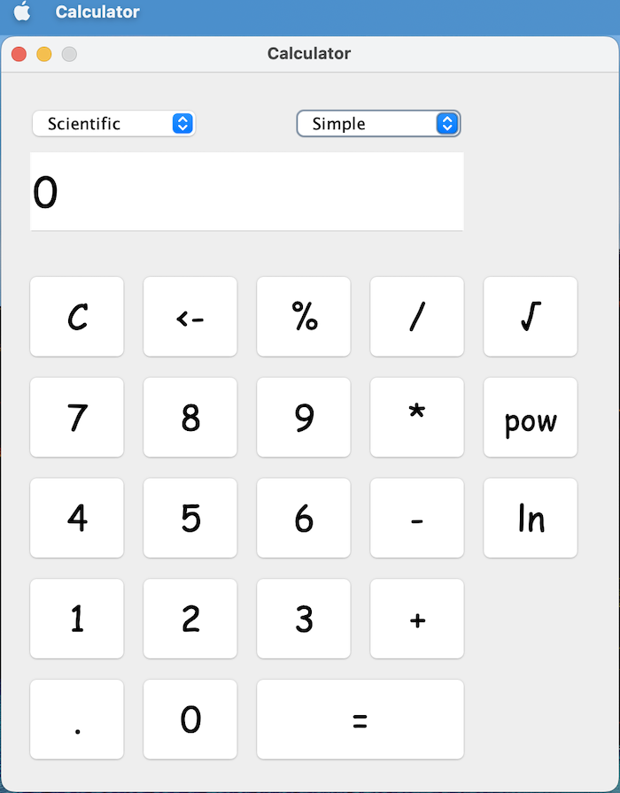

# Calculator GUI
This is a simple calculator app built in Java using the Swing library. The app allows users to perform arithmetic operations and some exponential operations (power, square root, nl).

## Features
- Support for:
  - Arithmetic operations (add, subtract, multiply, divide)
  - Percentage
  - Exponentiation
  - Square root
  - Natural logarithm
- Ability to clear the current calculation
- Ability to change the sign of the current operand
- Support for decimal numbers
- Ability to switch between standard mode and scientific mode
- 2 themes - Light Mode and Dark Mode

## Demo

## Getting started
To run the calculator app, you will need to have Java 8 or later installed on your computer. Follow these steps to run the app:

- Clone this repository to your local machine
- Open a terminal or command prompt and navigate to the directory where you cloned the repository
- Compile the code using the following command: `javac com/calculator/Calculator.java`
- Run the app using the following command: `java com.calculator.Calculator`

## Usage
- Click on the number buttons to enter operands
- Click on the operation buttons to select the operation to perform
- Click on the clear button (C) to clear the current calculation
- For arithmetic operations, click on an operator (+, -, /, *, %) between operands, then (=)
- For exponential operations, click on an operand and then the operator (√, pow, nl) (only 1 operand is used)
- Click on the decimal button (.) to enter a decimal point
- Click on the Calculator Mode dropdown to switch between Standard and Scientific modes
- Click on the theme switcher to select a theme

## Contributing
- [Java 8](https://www.java.com/en/download/help/java8.html)
- [Java Swing](https://docs.oracle.com/javase/tutorial/uiswing/start/index.html)

If you find any bugs or issues with the app, feel free to open a new issue in the GitHub repository. Pull requests are also welcome.

